# BioMedVisionLab

**A deployable biomedical visual evaluation workbench for image retrieval, super-resolution evaluation, and contact-map visualization.**

BioMedVisionLab is a research prototype for inspecting biomedical image-like data through an interactive dashboard. It supports chest X-ray retrieval benchmarking, super-resolution baseline/model-output comparison, and Hi-C/contact-map visualization.

The goal is **not diagnosis**. The goal is **visual evaluation**: helping researchers inspect model behavior, compare enhancement outputs, identify failure cases, and export experiment summaries.

---

## Live Demo

Try the deployed app here:

**https://huggingface.co/spaces/Mahrufa/BioMedVisionLab**

Hosted demo mode is intended for small uploaded samples. Large datasets, full benchmarks, and GPU-heavy workflows should be tested locally or on suitable research infrastructure.

---

## Why This Project Matters

Biomedical AI models often produce embeddings, enhanced images, or reconstructed matrices, but researchers still need clear ways to inspect whether those outputs are meaningful.

BioMedVisionLab helps with:

- **Inspecting retrieval behavior** instead of only looking at final numbers.
- **Comparing baseline vs model-enhanced biomedical images** with visual and quantitative metrics.
- **Visualizing image-like biological matrices**, such as Hi-C/contact maps, for resolution-style analysis.

BioMedVisionLab is designed as a reusable visual evaluation workbench for biomedical image-like data, including radiology images, microscopy/chemical imaging outputs, pathology-style images, and genomic contact maps.

---

## Core Modules

| Module | What it does | Research value |
|---|---|---|
| **CXR Retrieval** | Retrieves visually similar chest X-rays using encoder embeddings. | Compares generic vs CXR-specific visual representations. |
| **Super-Resolution Demo** | Simulates low-resolution images, reconstructs them with bicubic interpolation, and compares metrics. | Provides a transparent baseline for biomedical image enhancement workflows. |
| **Grant Alignment Lab** | Visualizes synthetic or uploaded contact maps and compares low-resolution vs upscaled matrices. | Bridges the dashboard toward Hi-C/chromatin contact-map analysis. |

---

## Key Features

- Upload-first demo mode for biomedical images and contact maps.
- Chest X-ray retrieval using encoder embeddings.
- Encoder comparison support for:
  - ResNet18 ImageNet baseline
  - ResNet50 ImageNet baseline
  - TorchXRayVision DenseNet121 CXR encoder
- Retrieval metrics including Precision@K, Top-1 match, label distribution, and mean cosine similarity.
- Out-of-domain warning for non-CXR uploads.
- Super-resolution baseline evaluation using PSNR, SSIM, and MSE.
- Optional upload of model-enhanced images for comparison against bicubic baseline.
- Synthetic and uploaded contact-map visualization using CSV/NPY inputs.
- Hi-C/contact-map metrics including matrix PSNR, SSIM, MSE, and difference maps.
- CSV exports for experiment tracking and method comparison.
- Docker-based deployment on Hugging Face Spaces.

---

## Screenshots

The screenshots below show the full local research mode of **BioMedVisionLab** with a prebuilt CXR index. They are included so reviewers can understand the project even without running the app locally.

### 1. CXR Retrieval Workflow

The CXR retrieval module visualizes query-image retrieval, embedding-based nearest neighbors, retrieval confidence, and batch evaluation.

#### CXR retrieval overview

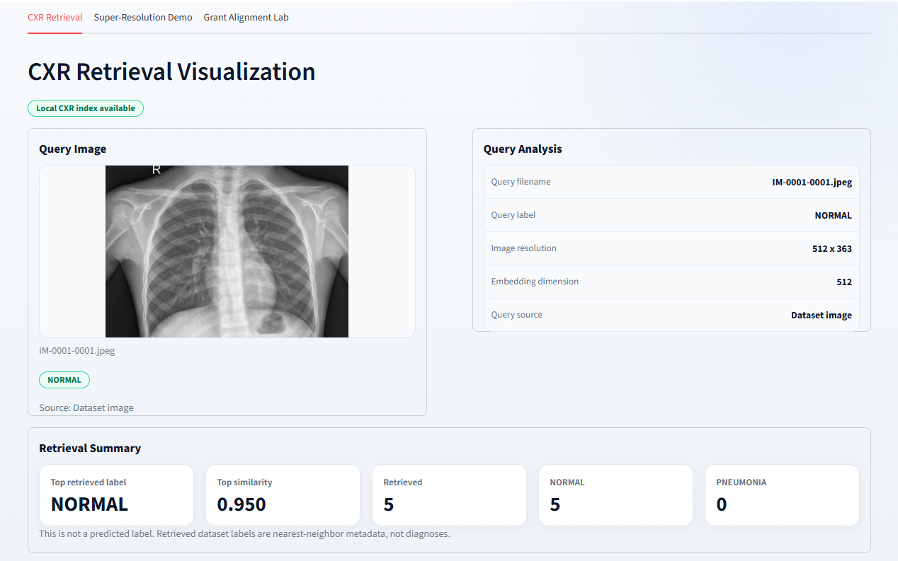

#### Retrieval quality, triage, and model card

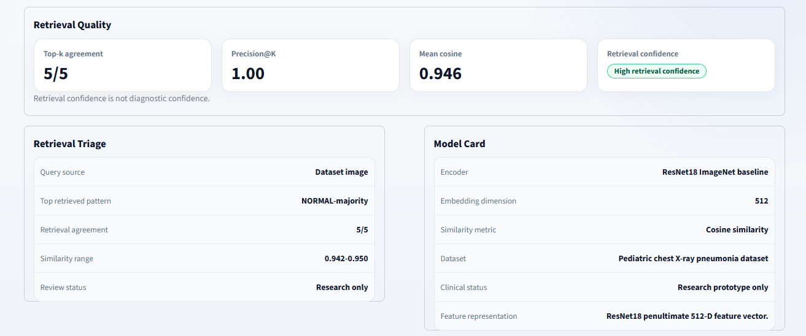

#### Visual explanation preview

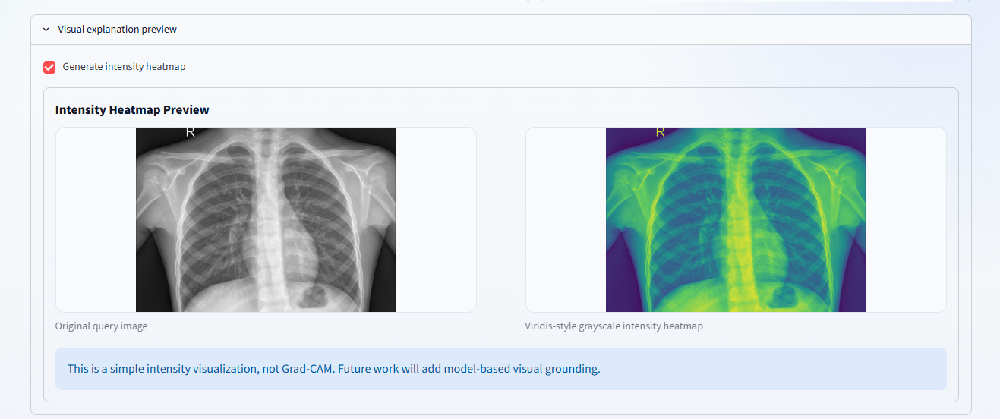

#### Query vs retrieved comparison

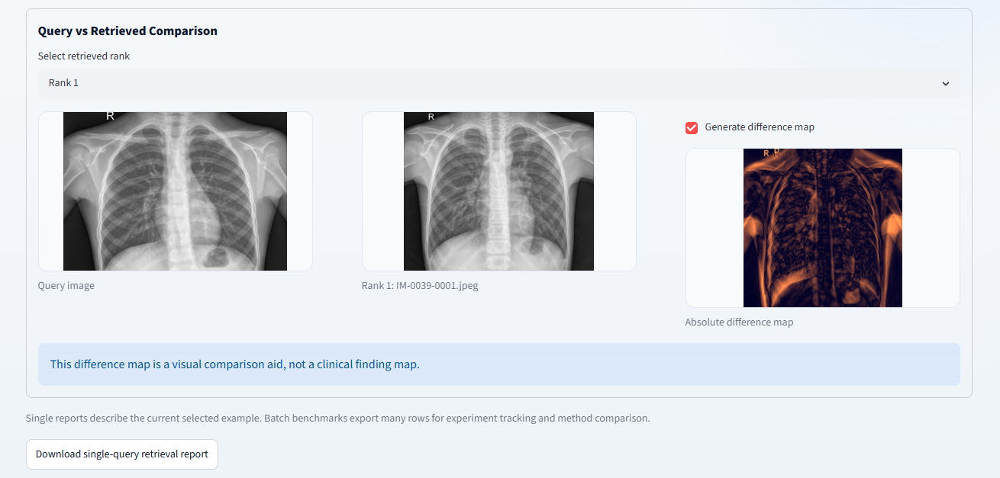

#### Top-k sensitivity

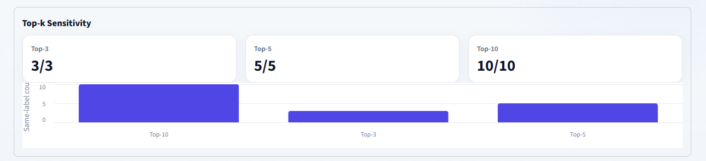

#### Similar case board

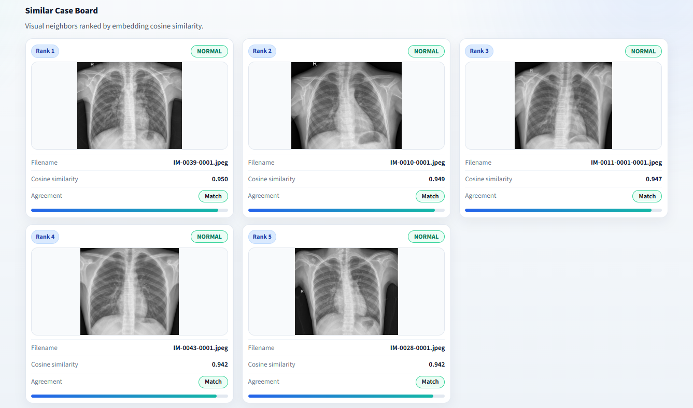

#### Compact result table and similarity distribution

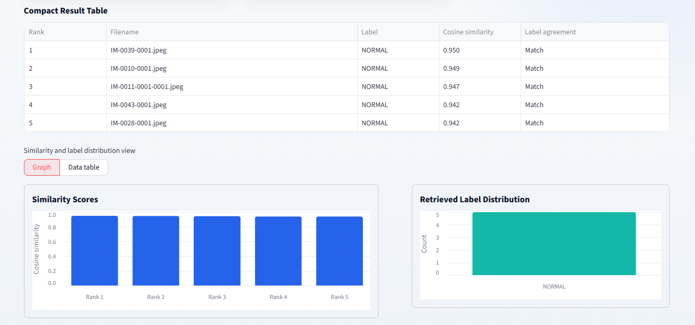

#### Batch retrieval evaluation

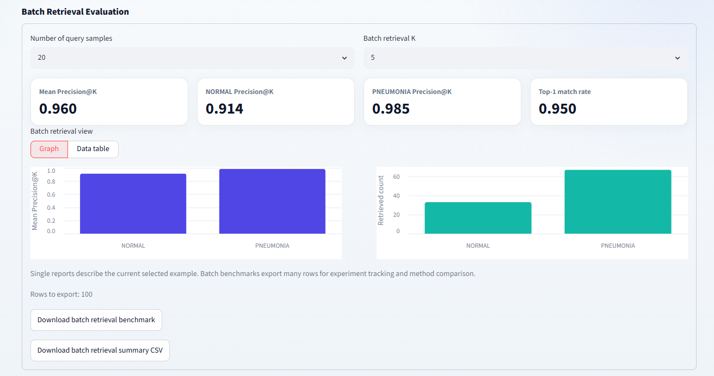

#### Sidebar controls and encoder/query selectors

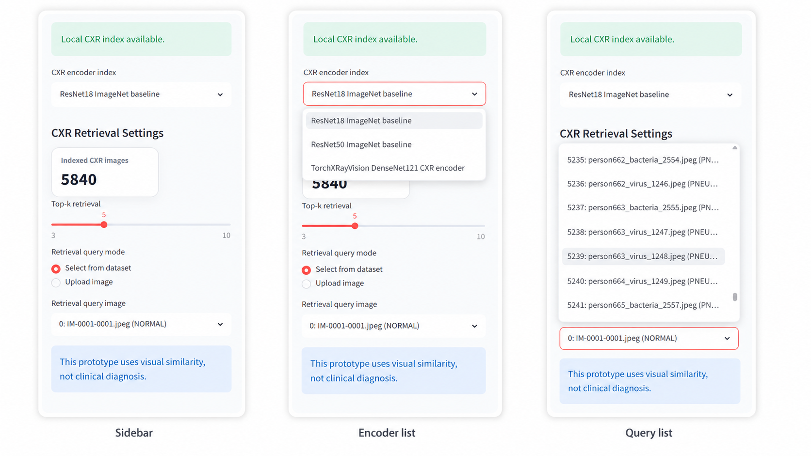

---

### 2. Super-Resolution Evaluation Workflow

The super-resolution module compares original, simulated low-resolution, bicubic reconstruction, and optional uploaded model outputs using PSNR, SSIM, MSE, and crop-level visual inspection.

#### Super-resolution overview

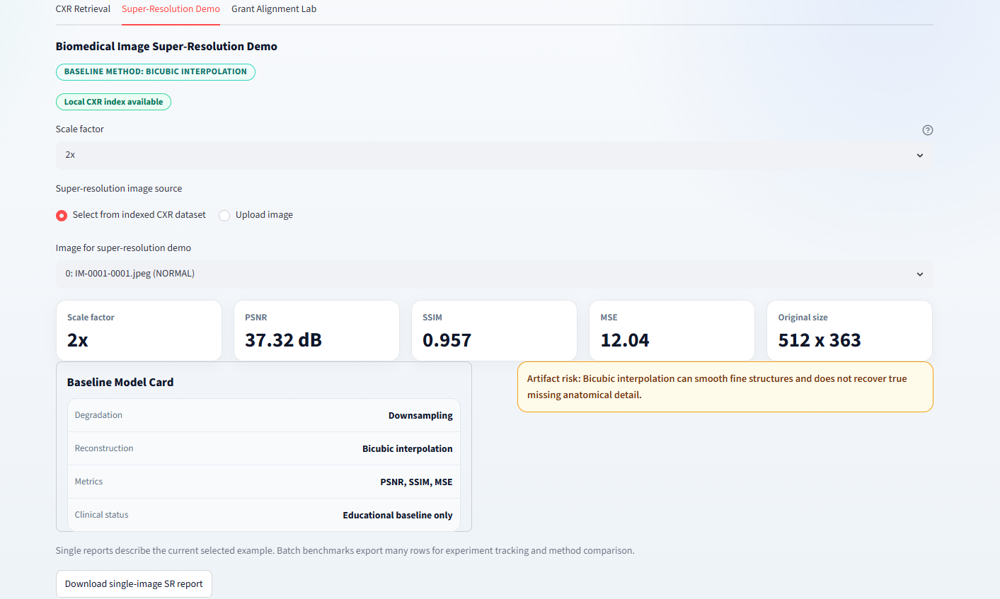

#### Original, low-resolution, and bicubic enhanced images


#### Zoomed crop comparison

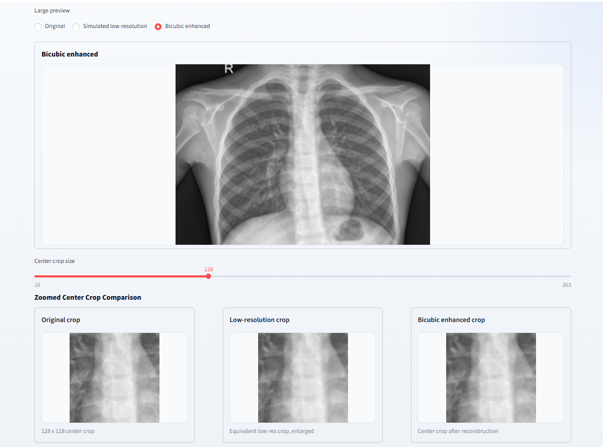

#### Uploaded model output comparison

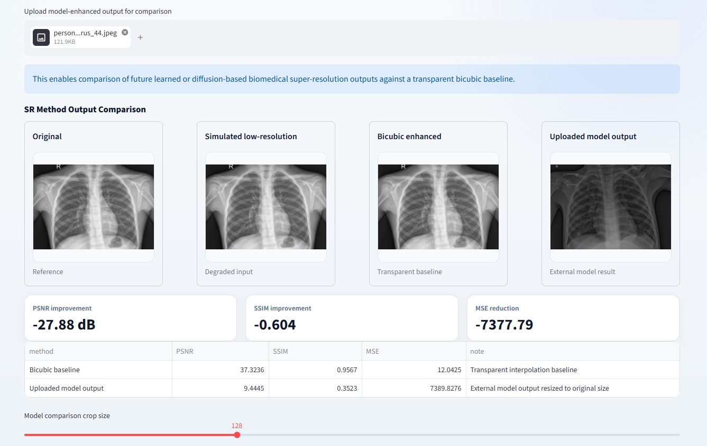

#### Uploaded model crop comparison

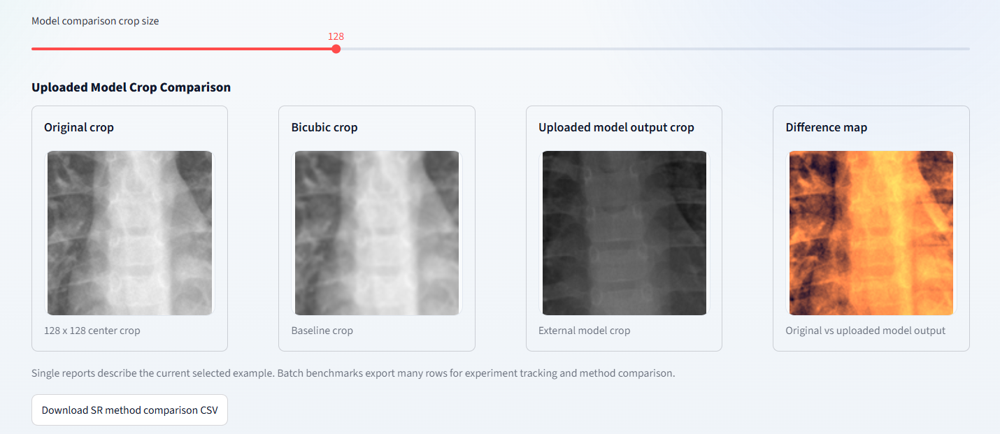

#### Batch super resolution comparison


---

### 3. Hi-C / Contact Map Visualization Workflow

The Grant Alignment Lab extends the same visual evaluation pattern to image-like genomic contact matrices, including uploaded CSV/NPY contact maps, synthetic contact maps, downsampling, bicubic upscaling, difference maps, and diagonal profile summaries.

#### Uploaded Hi-C contact map with viridis colormap

 

#### Uploaded Hi-C contact map with inferno colormap

 

#### Diagonal-insulation style profile

  


---

## Quick Start

Clone the repository:

```bash
git clone https://github.com/mahrufa-binta-ali/BioMedVisionLab.git
cd BioMedVisionLab
```

Create and activate a virtual environment.

On Windows:

```bash
python -m venv venv
venv\Scripts\activate
```

On macOS/Linux:

```bash
python -m venv venv
source venv/bin/activate
```

Install dependencies:

```bash
pip install -r requirements.txt
```

Run the app:

```bash
python -m streamlit run app.py
```

---

## Optional: Build a Local CXR Index

The deployed demo can run in upload-first mode. For local CXR retrieval benchmarking, place a chest X-ray dataset under:

```text
data/chest_xray/
    train/
        NORMAL/
        PNEUMONIA/
    test/
        NORMAL/
        PNEUMONIA/
```

Then build embeddings for one or more encoders:

```bash
python build_index.py --encoder resnet18_imagenet
python build_index.py --encoder resnet50_imagenet
python build_index.py --encoder torchxrayvision_densenet121
```

Embeddings are saved under:

```text
embeddings/
    resnet18_imagenet/
    resnet50_imagenet/
    torchxrayvision_densenet121/
```

Large datasets and embedding files are intentionally excluded from Git.

---

## Deployment

This project is deployed using **Docker on Hugging Face Spaces**.

The Space uses:

```yaml
sdk: docker
app_port: 7860
```

The Dockerfile runs the Streamlit app on port `7860`.

To deploy manually:

1. Create a new Hugging Face Space.
2. Select **Docker** as the SDK.
3. Push this repository to the Space.
4. Hugging Face will build the Docker image and launch the app.

Example push command:

```bash
git remote add space https://huggingface.co/spaces/Mahrufa/BioMedVisionLab
git push space main
```

If the Space already has an initial commit and rejects the push, use:

```bash
git push space main --force
```

---

## CSV Reports

BioMedVisionLab supports CSV exports for experiment tracking.

Single reports describe the current selected example. Batch benchmark reports export many rows and are intended for method comparison.

| Report | Purpose |
|---|---|
| Single-query retrieval report | Inspect one query and its retrieved cases. |
| Batch retrieval benchmark | Compare retrieval quality over many query images. |
| Batch retrieval summary | Summarize Precision@K, Top-1 match, and class-level retrieval behavior. |
| Single-image SR report | Record PSNR, SSIM, and MSE for one image. |
| Batch SR benchmark | Evaluate reconstruction metrics over many images. |
| Hi-C matrix evaluation report | Record contact-map enhancement metrics for a matrix experiment. |

---

## Intended Use

BioMedVisionLab is intended for:

- Research prototyping
- Visual model evaluation
- Biomedical image-like data inspection
- Retrieval benchmarking
- Super-resolution baseline comparison
- Contact-map visualization experiments
- Teaching and portfolio demonstration

It is **not** intended for clinical diagnosis, patient-facing use, or medical decision-making.

---

## Limitations

- This is a research prototype, not a diagnostic system.
- Retrieval labels come from nearest dataset examples and should not be interpreted as predictions.
- Retrieval confidence is not clinical confidence.
- Bicubic super-resolution is a transparent baseline, not a trained AI enhancement model.
- Synthetic Hi-C/contact maps are interface demonstrations, not biological results.
- Uploaded files in hosted demo mode are processed temporarily during the session.
- Large biomedical datasets may require local execution or GPU-backed infrastructure.
- The current hosted demo is designed for small samples, not full-scale clinical or genomics pipelines.

---

## Research Roadmap

Planned extensions include:

- CXR-specific foundation-model encoders.
- Grad-CAM or model-based visual grounding.
- Report-aware CXR retrieval using radiology text.
- Microscopy/pathology super-resolution benchmarks.
- Diffusion-based biomedical image enhancement comparison.
- Real `.cool` / `.mcool` Hi-C contact-map support.
- Batch evaluation dashboards for multiple models and datasets.

---

## Tech Stack

- Python
- Streamlit
- PyTorch
- torchvision
- TorchXRayVision
- NumPy
- pandas
- scikit-image
- Altair
- Docker
- Hugging Face Spaces

---

## Project Structure

```text
BioMedVisionLab/
│
├── app.py
├── build_index.py
├── requirements.txt
├── Dockerfile
├── README.md
├── .gitignore
│
├── .streamlit/
│   └── config.toml
│
├── docs/
│   ├── TECHNICAL_NOTES.md
│   └── ROADMAP.md
│
├── data/          # ignored by Git
├── embeddings/    # ignored by Git
└── assets/        # optional screenshots/GIFs
```

---

## Disclaimer

BioMedVisionLab is a research visualization prototype. It is not approved for clinical use and should not be used for diagnosis, treatment planning, or medical decision-making.

Uploaded images are not classified by the app. Labels shown in retrieval modules come from nearest reference examples and are only used for visualization and evaluation.

---

## Author

**Mahrufa Binta Ali**

GitHub: [mahrufa-binta-ali](https://github.com/mahrufa-binta-ali)

Project: [BioMedVisionLab](https://github.com/mahrufa-binta-ali/BioMedVisionLab)
